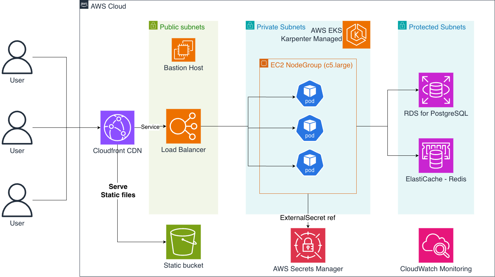

# Zenith Infrastructure Terraform

Jot down description and instructions for your Terraform project.

---

## Diagram


## Introduction

Jot down a brief description of the project, its purpose, and any.

---
## Structure
```
.
├── env/
│   ├──your-env/              # Description of your environment (dev/prod)
├── modules/
│   ├── nested_module/        # Simple description of the module
├── keypair/                  # SSH public keys consumed by the bastion module
├── README.md
└── terraform.*               # Shared configs / helpers
```

---
## Module Overview
| Module      | Purpose |
|-------------|---------|
| **nested_module** | Write your module purpose here. |

---
## SSH Key Preparation
The EC2 bastion module expects a public key at `keypair/<key_name>.pub`.

```bash
# Generate a new SSH key pair
mkdir -p keypair
ssh-keygen -t ed25519 -f keypair/ec2-kp-prod -C "ops@somedomain"

# Result: keypair/ec2-kp-prod (private) & keypair/ec2-kp-prod.pub (public)
# Ensure the .pub file name matches `bastion_key_name` used in tfvars.
```

> ⚠️ Never commit private keys. Keep only the public `.pub` file in repo if
> needed.

---
## Deploying Environments
Each environment maintains its own backend, variables, and tfvars.

### 1. Configure `terraform.tfvars`
Edit the environment-specific `terraform.tfvars` and set secrets:
```hcl
# env/dev/terraform.tfvars
environment           = "dev"
project_name          = "aws-base-infra"
region                = "ap-northeast-2"
prefix                = "sigmoid"
```
Copy to `env/prod/terraform.tfvars` and adjust CIDR, instance types, password,
and retention values as needed.

### 2. Initialize
From the environment directory:
```bash
cd env/dev
terraform init
```
Repeat inside `env/prod` when ready.

### 3. Validate & Plan
```bash
terraform validate
terraform plan -out dev.plan
```

### 4. Apply
```bash
terraform apply dev.plan
```

### 5. Promote to Production
```bash
cd ../prod
terraform init
terraform validate
terraform plan -out prod.plan
terraform apply prod.plan
```

> ☝️ Write any additional instructions or caveats for deploying here.

---
## Useful Outputs
Both environments export key outputs such as <resources name goes here>. Run
`terraform output` inside the environment directory to inspect.

---
## Notes
- Add any additional notes, caveats, or instructions here.